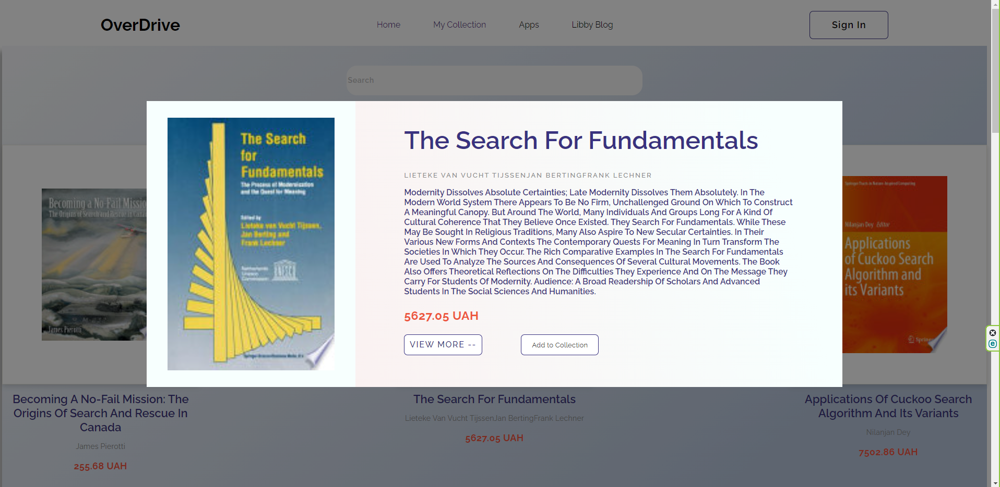
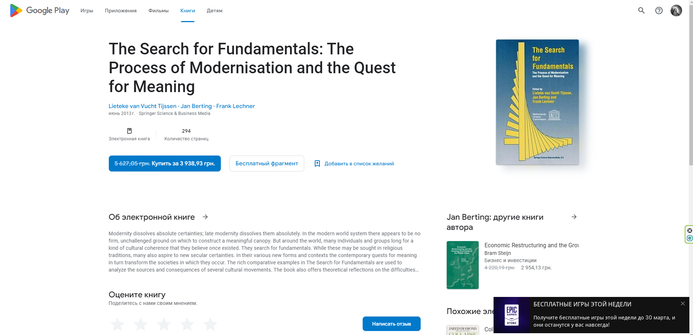
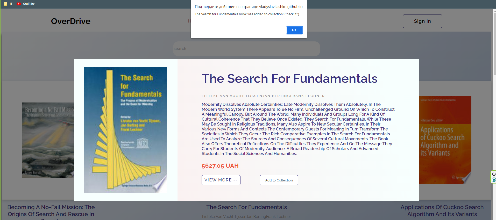
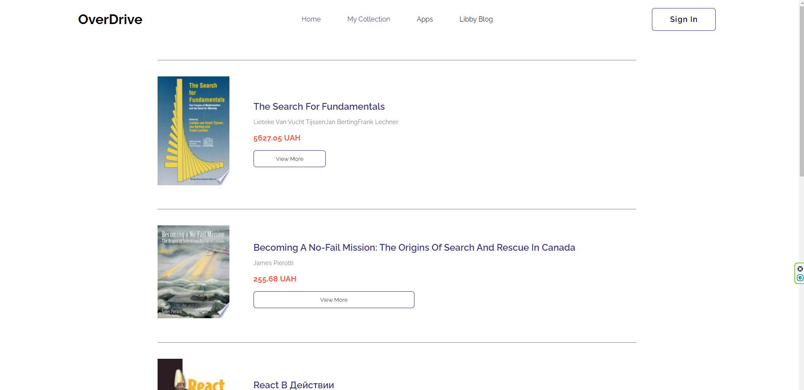

<h1> Book Library </h1>
<h2> About </h2> 

 In this project, I made a website where you can find and read information about any book that is in Google Books. I used Google Books api to search and display books, also using Redux I made it possible to add a book to "My collection" 

<h2> Technologies </h2>
<ul>
  <li> HTML5</li>
  <li> CSS3</li>
  <li> SCSS</li>
  <li> Java Script</li>
  <li> React</li>
  <li> Redux</li>
  <li> React Router</li>
</ul>

<h2>Features</h2>
<h3> <b>Search Books </b> </h3>

Users can search for books by keywords in the "search" field by pressing the "Enter" button. However, google books api doesn't always give the response the first time. If this happens - enter the name of the book you want to find again and press "Enter" 

 
<h3> <b>Modal window</b> </h3>

Users can view more detailed information about the book by clicking on it. After that, a modal window with detailed information will pop up. 

 
<h3> <b>View more info about book</b> </h3>

Users can view more information about the book, or even buy it on Google Books. To do this, click "view more" in the modal window, and you will be redirected to the google books website

 
<h3> <b>Add book to collection</b> </h3>

Users can add a book to their collection. To do this, click on the "add to collection" button in the modal window. After that, a browser window pops up with a notification that the book has been added to the collection

 
<h3> <b>"My Collection" page</b> </h3>

Users can view their collection of books they have added. To do this, go to the "My collection" page, which will display all the books that you have added.  
P.S. after reloading the page, the selected books will not be saved

  